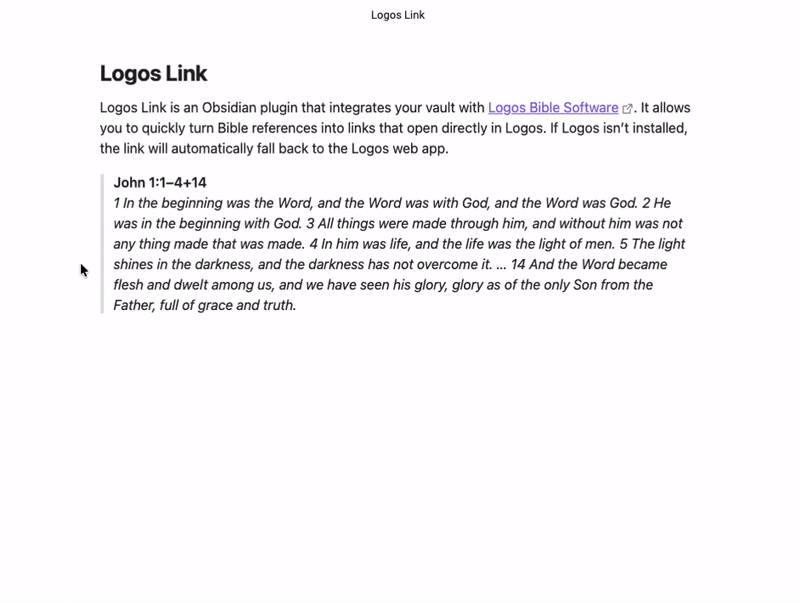
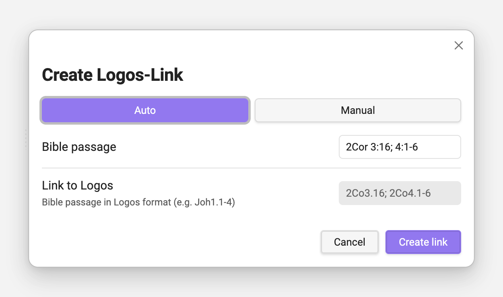

# Logos Link
This plugin helps Obsidian along with [Logos](https://www.logos.com) (Bible Software). 
With this plugin you can easily create links of bible passages, which open the correct passage directly in Logos.
When Logos is not installed it will show the passage in the web.

Currently, it can handle book names in English and German.
It can even handle multiple formats and sequences of bible verses.
- 2Cor 3:16; 4:1-6
- Eph 1,18–19; 3,8–11.16–21
- 1 Peter 5:7-8
- ...

---

MIT licensed | Copyright © 2025 David Troyer

